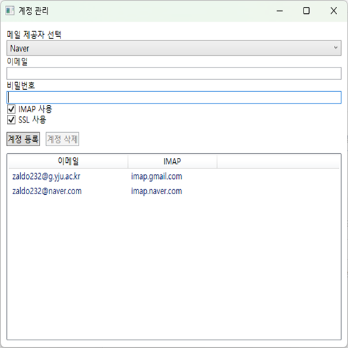

# 통합 이메일 관리

## 프로젝트 개요

  **여러 이메일 계정을 한 곳에서 통합 관리**할 수 있는 WPF 기반 이메일 클라이언트입니다.  
- WPF 데스크탑 이메일 클라이언트 (.NET 8, MVVM, SQLite)
- 다중 이메일 계정/POP3/IMAP/SMTP 지원, AES 암호화 저장
- POP3/IMAP/SMTP 프로토콜 지원, 메일 송수신/검색/관리, 계정 암호화 저장,  
- MVVM 구조, SQLite 내장 DB, 실시간 폴링
- **클라이언트:** WPF MVVM, 실시간 메일 수신, 여러 계정 동시 관리, AES 암호화, UI/UX 최적화  
- **로컬 DB:** SQLite(이메일 계정/설정/임시 데이터 암호화 저장)

---

## 아키텍처


### 전체 구조
```plaintext
UnifiedEmail/
├─ Models/               # EmailAccountModel, EmailMessageModel 등 데이터 모델
├─ Services/             # EmailService(POP3/IMAP/SMTP), DatabaseService, EncryptionService
├─ Helpers/              # WPF 바인딩/유틸리티 컨버터 등
├─ ViewModels/           # AccountViewModel, EmailListViewModel 등 MVVM 뷰모델
├─ Views/                # XAML 화면 및 코드비하인드
├─ Messages/             # MVVM 메시징(뷰모델간 통신)
├─ Resources/            # (확장가능, 이미지/아이콘/스타일 등)
├─ App.xaml(.cs)         # 앱 진입점/리소스
└─ ...
```

------------------------------

## 요구사항 및 NuGet 라이브러리

### 클라이언트
- **운영체제:** Windows 10/11
- **.NET:** .NET 8 이상
- **IDE:** Visual Studio 2022 이상
- **DB:** SQLite (내장, 이메일 계정/설정 관리)
- **NuGet 패키지:**
  - `CommunityToolkit.Mvvm` (MVVM)
  - `MailKit`, `MimeKit` (POP3/IMAP/SMTP)
  - `Microsoft.Data.Sqlite`
  - `BouncyCastle` (AES 등 암호화)
  - 기타 WPF/SQLite 연동 관련

---

## 주요 기능

### 이메일 관리
- **계정 추가/삭제**: Gmail, Naver, Daum 등 IMAP/POP3 SMTP 자동 셋팅 지원
- **실시간 메일 수신/발신**: 폴링 기반, 새로운 메일 자동 표시
- **메일 목록/상세**: 폴더별(받은편지함, 보낸편지함 등) 분류, 첨부파일 표시
- **메일 작성/첨부**: 새 메일 작성, 첨부파일, 이미지, HTML 지원
- **메일 검색/정렬/필터**: 키워드, 날짜, 발신자 등 다양한 조건
- **다중 계정 동시 관리**: 계정별/전체 보기, 전환
- **AES 암호화 저장**: 모든 계정 정보 AES 등으로 암호화 저장, 안전한 로컬 보안

---

## 기술 스택

- **C#, .NET 8, WPF**
- **MVVM (CommunityToolkit.Mvvm)**
- **MailKit/MimeKit** (이메일 프로토콜/암호화)
- **SQLite** (로컬 계정/설정 관리)
- **BouncyCastle** (AES 암호화)
- **ObservableCollection** (실시간 데이터 바인딩)

---

## 스크린샷

| 계정관리화면 | 메일작성화면 |
|----------|----------|
|  |  |

| 기본화면(불러오기x) | 기본화면(불러오기o) |
|----------|--------------|
|  |  |

| 기본화면(검색필터) | 본문화면 |
|----------|--------------|
|  |  |
